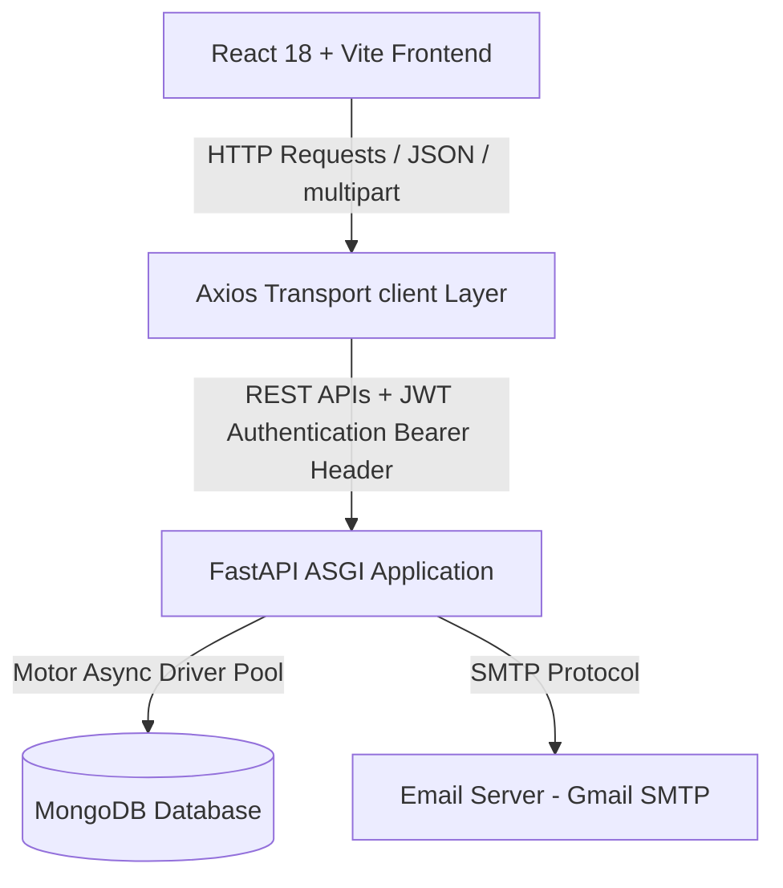

# System Documentation

This document provides a detailed overview of the system architecture, modular layout, and API structure for the **Enterprise Multi-Channel Ecommerce KPI Management System**.

---

## 1. System Overview
The Ecommerce KPI Management System is an enterprise-grade performance tracking and analytics platform. It collects, aggregates, and processes operational data across multiple sales channels. The system acts as a central workspace for tracking employee activities, auditing customer risks (blacklist evaluation), registering order metrics, calculating daily KPIs, tracking monthly revenue goals, and auto-dispatching manager reports.

---

## 2. Architecture & Data Flow

### 2.1. Tech Stack Details
* **Frontend**: React 18 (TypeScript), Vite (build runner), Axios (HTTP transport), Zustand (lightweight global state management), Recharts (responsive vector charts), TailwindCSS (premium theme/styling rules), and Lucide React (vector interface iconography).
* **Backend**: FastAPI (asynchronous Python ASGI framework), Motor (non-blocking async MongoDB driver), Pydantic v2 (data modeling, validation, and serialization), python-jose (JWT token signature verification), passlib (secure bcrypt hashing), and APScheduler (cron-like background tasks execution).
* **Database**: MongoDB (NoSQL JSON document store) using indexing rules on critical keys (such as phone numbers, employee IDs, and timestamps) for sub-millisecond query execution.

---

## 3. Modular Layout

### 3.1. Backend Modules
1. **Authentication**: Resolves employee login credential verification, session validation, and JWT token issue/revocation.
2. **Employees**: Full CRUD for profiles, platform permissions, active statuses, and automatic sequence employee codes.
3. **Orders**: Registers sales transaction data, totals, dates, and maps orders to the performing employee for KPI lookup.
4. **Chats**: Tracks daily customer service chats, durations, and logs chat sessions per employee.
5. **Notifications**: System-wide notifications flagged by roles (Admin, Manager, Employee) or targeted to specific user IDs.
6. **Revenues**: Registers operational revenue markers, platforms, channels, and gathers monthly sales target details.
7. **KPI**: Aggregates employee daily performance scores and metrics.
8. **Rewards**: Tracks rewards, achievements, bonuses, and penalties allocated to staff.
9. **Reports**: Formulates high-level performance digests (KPI/Revenue trends) and queues them for delivery.
10. **Customer Blacklist**: Tracks flagged/blocked customers. Runs automatic risk scoring assessments against order history.
11. **Settings**: Central registry for saving/retrieving global parameters, notifications configurations, and layouts.
12. **Audit Logs**: Trace records logging sensitive mutations, resource adjustments, and user identity tags.
13. **Employee Sessions**: Tracks logins, active times, source IP footprints, and token expiration windows.
14. **Product Activities**: Tracks product listings, inventory audits, and related employee events.
15. **Dashboard**: Unified aggregator retrieving real-time card summaries, order/revenue charts, and feed lists.

### 3.2. Frontend Modules
1. **Dashboard**: Main visual panel containing global metrics, date range filters, real-time Recharts trends, manual sync, and PDF/Excel downloads.
2. **Employees**: Operational staff console managing employee search, status filters, profile creations, and edit forms.
3. **Revenues**: Financial console displaying performance charts, target achievements, and CSV exports.
4. **Blacklist**: Safety console supporting direct search-by-phone, adding flags, and running automatic risk calculations.
5. **Reports**: Audit console generating target performance statistics, charts, and triggering reports.
6. **Settings**: Unified workspace featuring three sub-tabs: General Settings, Dashboard Configuration, and Notification Preferences.

---

## 4. API Endpoints Reference

Below is the complete inventory of API routes exposed under `/api/v1` of the FastAPI app, extracted directly from the system router setup.

### 4.1. Authentication Router (`/api/v1/auth`)
| Method | Route | Name | Purpose |
| :--- | :--- | :--- | :--- |
| **POST** | `/api/v1/auth/login` | `login` | Authenticate employee credentials and issue session JWT access tokens. |
| **POST** | `/api/v1/auth/logout` | `logout` | Invalidate an employee session and revoke credentials state. |
| **POST** | `/api/v1/auth/swagger-login` | `swagger_login` | Authenticate employee credentials via URL-encoded form data for Swagger Authorize flow. |
| **GET** | `/api/v1/auth/validate` | `validate_user` | Validate current active employee credentials and session. |

### 4.2. Employees Router (`/api/v1/employees`)
| Method | Route | Name | Purpose |
| :--- | :--- | :--- | :--- |
| **POST** | `/api/v1/employees` | `create_employee` | Create a new employee profile and sequential employee code. |
| **GET** | `/api/v1/employees` | `list_employees` | Retrieve employee profiles list with pagination support. |
| **POST** | `/api/v1/employees/` | `create_employee` | (Trailing slash fallback) Create a new employee profile. |
| **GET** | `/api/v1/employees/` | `list_employees` | (Trailing slash fallback) Retrieve employee profiles list. |
| **GET** | `/api/v1/employees/{employee_id}` | `get_employee` | Retrieve employee profile details by ID. |
| **PUT** | `/api/v1/employees/{employee_id}` | `update_employee` | Perform a partial update on the employee profile. |
| **DELETE** | `/api/v1/employees/{employee_id}` | `delete_employee` | Soft-deactivate an employee profile (setting status to Inactive). |

### 4.3. Orders Router (`/api/v1/orders`)
| Method | Route | Name | Purpose |
| :--- | :--- | :--- | :--- |
| **POST** | `/api/v1/orders` | `create_order` | Create a new order entry. |
| **GET** | `/api/v1/orders` | `list_orders` | Retrieve all orders with pagination support. |
| **POST** | `/api/v1/orders/` | `create_order` | (Trailing slash fallback) Create a new order entry. |
| **GET** | `/api/v1/orders/` | `list_orders` | (Trailing slash fallback) Retrieve all orders with pagination. |
| **GET** | `/api/v1/orders/stats/employee/{employee_id}` | `get_employee_stats` | Aggregate order statistics for a specific employee within a date range. |
| **GET** | `/api/v1/orders/{order_id}` | `get_order` | Retrieve order details by ID. |
| **PUT** | `/api/v1/orders/{order_id}` | `update_order` | Perform a partial update on an order. |
| **DELETE** | `/api/v1/orders/{order_id}` | `delete_order` | Delete an order. |

### 4.4. Chats Router (`/api/v1/chats`)
| Method | Route | Name | Purpose |
| :--- | :--- | :--- | :--- |
| **POST** | `/api/v1/chats` | `create_chat` | Create a new daily chat conversation metric record. |
| **GET** | `/api/v1/chats` | `list_chats` | Retrieve all daily chat conversation metrics records with pagination. |
| **POST** | `/api/v1/chats/` | `create_chat` | (Trailing slash fallback) Create a new daily chat metric record. |
| **GET** | `/api/v1/chats/` | `list_chats` | (Trailing slash fallback) Retrieve all daily chat metrics. |
| **GET** | `/api/v1/chats/employee/{employee_id}` | `get_employee_chat_stats` | Retrieve daily chat metrics for a specific employee on a given date. |
| **GET** | `/api/v1/chats/{chat_id}` | `get_chat` | Retrieve daily chat metrics details by ID. |
| **PUT** | `/api/v1/chats/{chat_id}` | `update_chat` | Perform a partial update on a daily chat metric record. |
| **DELETE** | `/api/v1/chats/{chat_id}` | `delete_chat` | Delete a daily chat conversation metric record. |

### 4.5. Notifications Router (`/api/v1/notifications`)
| Method | Route | Name | Purpose |
| :--- | :--- | :--- | :--- |
| **POST** | `/api/v1/notifications` | `create_notification` | Create a new notification. |
| **GET** | `/api/v1/notifications` | `list_notifications` | Retrieve all notifications. |
| **POST** | `/api/v1/notifications/` | `create_notification` | (Trailing slash fallback) Create a new notification. |
| **GET** | `/api/v1/notifications/` | `list_notifications` | (Trailing slash fallback) Retrieve all notifications. |
| **GET** | `/api/v1/notifications/unread/role/{role}` | `get_unread_by_role` | Retrieve unread notifications targeted at a specific role group. |
| **GET** | `/api/v1/notifications/unread/user/{user_id}` | `get_unread_by_user` | Retrieve unread notifications for a specific employee. |
| **DELETE** | `/api/v1/notifications/{notification_id}` | `delete_notification` | Delete a notification. |
| **POST** | `/api/v1/notifications/{notification_id}/read` | `mark_notification_as_read` | Mark a specific notification as read. |

### 4.6. Revenues Router (`/api/v1/revenues`)
| Method | Route | Name | Purpose |
| :--- | :--- | :--- | :--- |
| **POST** | `/api/v1/revenues` | `create_revenue` | Create a new daily/monthly revenue record. |
| **GET** | `/api/v1/revenues` | `list_revenues` | Retrieve all revenue records with pagination support. |
| **POST** | `/api/v1/revenues/` | `create_revenue` | (Trailing slash fallback) Create a new daily/monthly revenue record. |
| **GET** | `/api/v1/revenues/` | `list_revenues` | (Trailing slash fallback) Retrieve all revenue records. |
| **GET** | `/api/v1/revenues/stats/employee/{employee_id}` | `get_employee_stats` | Aggregate revenue statistics for a specific employee within a date range. |
| **GET** | `/api/v1/revenues/{revenue_id}` | `get_revenue` | Retrieve details of a specific revenue record by ID. |
| **PUT** | `/api/v1/revenues/{revenue_id}` | `update_revenue` | Perform a partial update on a specific revenue record. |
| **DELETE** | `/api/v1/revenues/{revenue_id}` | `delete_revenue` | Delete a specific revenue record. |

### 4.7. KPI Router (`/api/v1/kpi`)
| Method | Route | Name | Purpose |
| :--- | :--- | :--- | :--- |
| **POST** | `/api/v1/kpi` | `create_kpi` | Create a new KPI daily record. |
| **GET** | `/api/v1/kpi` | `list_kpis` | Retrieve all daily KPI records with pagination support. |
| **POST** | `/api/v1/kpi/` | `create_kpi` | (Trailing slash fallback) Create a new KPI daily record. |
| **GET** | `/api/v1/kpi/` | `list_kpis` | (Trailing slash fallback) Retrieve all daily KPI records. |
| **GET** | `/api/v1/kpi/history/employee/{employee_id}` | `get_employee_kpi_history` | Retrieve a specific employee's daily KPI history logs over a date range. |
| **GET** | `/api/v1/kpi/{kpi_id}` | `get_kpi` | Retrieve details of a daily KPI record by ID. |
| **DELETE** | `/api/v1/kpi/{kpi_id}` | `delete_kpi` | Delete a daily KPI record. |

### 4.8. Rewards Router (`/api/v1/rewards`)
| Method | Route | Name | Purpose |
| :--- | :--- | :--- | :--- |
| **POST** | `/api/v1/rewards` | `create_reward` | Create a new reward record. |
| **GET** | `/api/v1/rewards` | `list_rewards` | Retrieve all reward records with pagination support. |
| **POST** | `/api/v1/rewards/` | `create_reward` | (Trailing slash fallback) Create a new reward record. |
| **GET** | `/api/v1/rewards/` | `list_rewards` | (Trailing slash fallback) Retrieve all reward records. |
| **GET** | `/api/v1/rewards/history/employee/{employee_id}` | `get_employee_reward_history` | Retrieve employee reward history logs over a date range. |
| **GET** | `/api/v1/rewards/{reward_id}` | `get_reward` | Retrieve details of a specific reward record by ID. |
| **DELETE** | `/api/v1/rewards/{reward_id}` | `delete_reward` | Delete a reward record. |

### 4.9. Reports Router (`/api/v1/reports`)
| Method | Route | Name | Purpose |
| :--- | :--- | :--- | :--- |
| **POST** | `/api/v1/reports` | `create_report` | Create a new report. |
| **GET** | `/api/v1/reports` | `list_reports` | Retrieve all reports with pagination support. |
| **POST** | `/api/v1/reports/` | `create_report` | (Trailing slash fallback) Create a new report. |
| **GET** | `/api/v1/reports/` | `list_reports` | (Trailing slash fallback) Retrieve all reports. |
| **GET** | `/api/v1/reports/date` | `get_report_by_date` | Retrieve details of a report by its reference date. |
| **GET** | `/api/v1/reports/unsent` | `get_unsent_reports` | Retrieve all unsent reports. |
| **GET** | `/api/v1/reports/{report_id}` | `get_report` | Retrieve details of a specific report by ID. |
| **DELETE** | `/api/v1/reports/{report_id}` | `delete_report` | Delete a specific report. |
| **POST** | `/api/v1/reports/{report_id}/sent` | `mark_as_sent` | Mark a specific report as sent. |

### 4.10. Customer Blacklist Router (`/api/v1/customer_blacklist`)
| Method | Route | Name | Purpose |
| :--- | :--- | :--- | :--- |
| **POST** | `/api/v1/customer_blacklist` | `create_blacklist_entry` | Create a new customer blacklist record. |
| **GET** | `/api/v1/customer_blacklist` | `list_blacklist_entries` | Retrieve all customer blacklist records with pagination support. |
| **POST** | `/api/v1/customer_blacklist/` | `create_blacklist_entry` | (Trailing slash fallback) Create a new customer blacklist record. |
| **GET** | `/api/v1/customer_blacklist/` | `list_blacklist_entries` | (Trailing slash fallback) Retrieve all blacklist records. |
| **POST** | `/api/v1/customer_blacklist/evaluate` | `evaluate_customer_risk` | Calculate and update/save a customer's risk level based on order statistics. |
| **GET** | `/api/v1/customer_blacklist/phone/{customer_phone}` | `find_by_phone` | Find a customer blacklist record by phone number. |
| **GET** | `/api/v1/customer_blacklist/{blacklist_id}` | `get_blacklist_entry` | Retrieve details of a specific customer blacklist record by ID. |
| **PUT** | `/api/v1/customer_blacklist/{blacklist_id}` | `update_blacklist_entry` | Perform a partial update on a customer blacklist record. |
| **DELETE** | `/api/v1/customer_blacklist/{blacklist_id}` | `delete_blacklist_entry` | Delete a specific customer blacklist record. |

### 4.11. Settings Router (`/api/v1/settings`)
| Method | Route | Name | Purpose |
| :--- | :--- | :--- | :--- |
| **POST** | `/api/v1/settings` | `create_setting` | Create a new configuration setting. |
| **GET** | `/api/v1/settings` | `list_settings` | Retrieve all configuration settings with pagination support. |
| **POST** | `/api/v1/settings/` | `create_setting` | (Trailing slash fallback) Create a new configuration setting. |
| **GET** | `/api/v1/settings/` | `list_settings` | (Trailing slash fallback) Retrieve all configuration settings. |
| **GET** | `/api/v1/settings/key/{key}` | `get_setting_by_key` | Retrieve details of a configuration setting by its unique key. |
| **GET** | `/api/v1/settings/{setting_id}` | `get_setting` | Retrieve details of a configuration setting by ID. |
| **PUT** | `/api/v1/settings/{setting_id}` | `update_setting` | Perform a partial update on a configuration setting. |
| **DELETE** | `/api/v1/settings/{setting_id}` | `delete_setting` | Delete a configuration setting. |

### 4.12. Audit Logs Router (`/api/v1/audit_logs`)
| Method | Route | Name | Purpose |
| :--- | :--- | :--- | :--- |
| **POST** | `/api/v1/audit_logs` | `create_audit_log` | Create a new audit log record. |
| **GET** | `/api/v1/audit_logs` | `list_audit_logs` | Retrieve all audit logs with pagination support. |
| **POST** | `/api/v1/audit_logs/` | `create_audit_log` | (Trailing slash fallback) Create a new audit log record. |
| **GET** | `/api/v1/audit_logs/` | `list_audit_logs` | (Trailing slash fallback) Retrieve all audit logs. |
| **GET** | `/api/v1/audit_logs/entity/{entity_type}/{entity_id}` | `get_audit_logs_by_entity` | Retrieve all audit logs modifying a specific entity type and entity ID. |
| **GET** | `/api/v1/audit_logs/user/{user_id}` | `get_audit_logs_by_user` | Retrieve all audit logs generated by a specific user. |
| **GET** | `/api/v1/audit_logs/{log_id}` | `get_audit_log` | Retrieve details of a specific audit log record by ID. |
| **DELETE** | `/api/v1/audit_logs/{log_id}` | `delete_audit_log` | Delete a specific audit log record. |

### 4.13. Employee Sessions Router (`/api/v1/employee_sessions`)
| Method | Route | Name | Purpose |
| :--- | :--- | :--- | :--- |
| **POST** | `/api/v1/employee_sessions` | `create_session` | Create a new employee session record. |
| **GET** | `/api/v1/employee_sessions` | `list_sessions` | Retrieve all employee session records with pagination support. |
| **POST** | `/api/v1/employee_sessions/` | `create_session` | (Trailing slash fallback) Create a new employee session record. |
| **GET** | `/api/v1/employee_sessions/` | `list_sessions` | (Trailing slash fallback) Retrieve all employee session records. |
| **GET** | `/api/v1/employee_sessions/active/{session_id}` | `get_active_session` | Retrieve details of an active employee session by its session ID. |
| **POST** | `/api/v1/employee_sessions/revoke/{session_id}` | `revoke_session` | Revoke a specific employee login session by its session ID. |
| **POST** | `/api/v1/employee_sessions/revoke_all/employee/{employee_id}` | `revoke_all_employee_sessions` | Revoke all active sessions for a specific employee. |
| **GET** | `/api/v1/employee_sessions/{session_record_id}` | `get_session` | Retrieve details of a specific employee session record by ID. |
| **DELETE** | `/api/v1/employee_sessions/{session_record_id}` | `delete_session` | Delete a specific employee session record. |

### 4.14. Product Activities Router (`/api/v1/product_activities`)
| Method | Route | Name | Purpose |
| :--- | :--- | :--- | :--- |
| **POST** | `/api/v1/product_activities` | `create_activity` | Create a new product activity record. |
| **GET** | `/api/v1/product_activities` | `list_activities` | Retrieve all product activity records with pagination support. |
| **POST** | `/api/v1/product_activities/` | `create_activity` | (Trailing slash fallback) Create a new product activity record. |
| **GET** | `/api/v1/product_activities/` | `list_activities` | (Trailing slash fallback) Retrieve all product activity records. |
| **GET** | `/api/v1/product_activities/stats/employee/{employee_id}` | `get_employee_activity_stats` | Count logged product activities of a specific type for an employee in a date range. |
| **GET** | `/api/v1/product_activities/{activity_id}` | `get_activity` | Retrieve details of a product activity record by ID. |
| **PUT** | `/api/v1/product_activities/{activity_id}` | `update_activity` | Perform a partial update on a specific product activity record. |
| **DELETE** | `/api/v1/product_activities/{activity_id}` | `delete_activity` | Delete a specific product activity record. |

### 4.15. Dashboard Router (`/api/v1/dashboard`)
| Method | Route | Name | Purpose |
| :--- | :--- | :--- | :--- |
| **GET** | `/api/v1/dashboard/kpi` | `get_kpi` | Retrieve today's performance indicators and growth statistics. |
| **GET** | `/api/v1/dashboard/orders-chart` | `get_orders_chart` | Retrieve daily order count analytics for the last 30 days. |
| **GET** | `/api/v1/dashboard/recent-activities` | `get_recent_activities` | Retrieve merged recent activity feeds from multiple modules. |
| **GET** | `/api/v1/dashboard/revenue-chart` | `get_revenue_chart` | Retrieve daily revenue analytics for the last 30 days. |
| **GET** | `/api/v1/dashboard/summary` | `get_summary` | Retrieve global metrics summary (total revenue, orders, employees, sessions). |

### 4.16. Global Diagnostic Route
| Method | Route | Name | Purpose |
| :--- | :--- | :--- | :--- |
| **GET** | `/health` | `health_check` | Diagnostic check endpoint validating application name, version, and database connectivity. |
