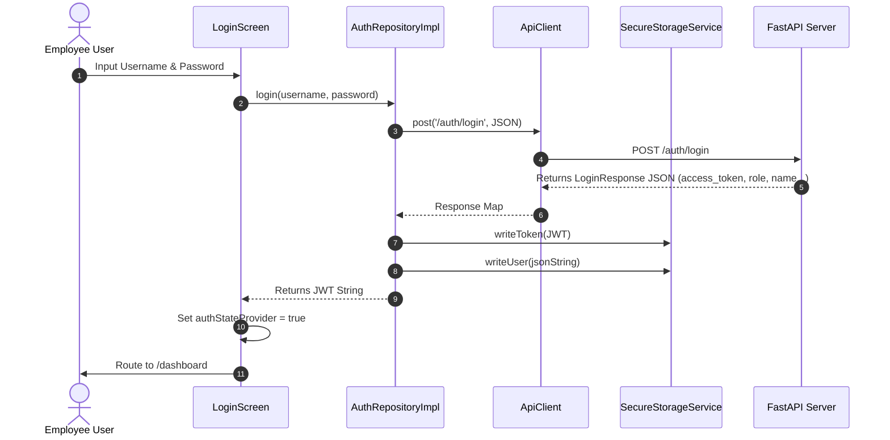

# API Integration Report - Phase 3

We connected the E-Commerce KPI Mobile app features to the real FastAPI backend running at `http://127.0.0.1:8000/api/v1`.

---

## Endpoints Connected

The following REST API endpoints are fully integrated into the Flutter client application:

| Feature | HTTP Method | Endpoint Path | Description |
| :--- | :--- | :--- | :--- |
| **Authentication** | `POST` | `/auth/login` | Session login and JWT issue |
| | `GET` | `/auth/validate` | Session validation and credentials validation |
| | `POST` | `/auth/logout` | Revokes sessions and clear active states |
| **Dashboard** | `GET` | `/dashboard/summary` | Numerical cards metrics overview |
| | `GET` | `/dashboard/kpi` | Real-time sales and growth overview |
| | `GET` | `/dashboard/revenue-chart` | Day-by-day revenue analytics history |
| | `GET` | `/dashboard/orders-chart` | Daily order volume logs |
| | `GET` | `/dashboard/recent-activities` | Recent transactions list |
| **Employees** | `GET` | `/employees` | List profiles |
| | `POST` | `/employees` | Create employee profile |
| | `PUT` | `/employees/{employee_id}` | Edit employee profile details |
| | `DELETE` | `/employees/{employee_id}` | Soft-deactivate employee status |
| **Revenue** | `GET` | `/revenues` | List revenue logs |
| **Rewards** | `GET` | `/rewards` | List company rewards |
| **Blacklist** | `GET` | `/customer_blacklist` | List high risk customers |
| **Notifications** | `GET` | `/notifications` | Notification alerts feed |
| | `POST` | `/notifications/{id}/read` | Mark individual notification as read |
| **Settings** | `GET` | `/settings` | System-wide config settings |
| | `PUT` | `/settings/{id}` | Update settings payload |

---

## Files Modified & Added

* **Core Client & Network**:
  * [api_client.dart](file:///d:/ecommerce_kpi_mobile/lib/core/network/api_client.dart) - Enhanced to allow custom callback notifications on `401 Unauthorized` responses and attach Bearer tokens.
  * [providers.dart](file:///d:/ecommerce_kpi_mobile/lib/core/network/providers.dart) - Overhauled to declare real repository classes, convert mock FutureProviders to dynamic `AsyncNotifier`s, and map JSON schemas cleanly.
* **Repositories**:
  * [auth_repository.dart](file:///d:/ecommerce_kpi_mobile/lib/data/repositories/auth_repository.dart) - Implemented flat LoginResponse fields caching in secure storage.
  * [dashboard_repository.dart](file:///d:/ecommerce_kpi_mobile/lib/data/repositories/dashboard_repository.dart) - Refactored to fetch individual summary, kpi, and chart endpoints.
  * [employee_repository.dart](file:///d:/ecommerce_kpi_mobile/lib/data/repositories/employee_repository.dart) [NEW] - CRUD endpoints connector.
  * [revenue_repository.dart](file:///d:/ecommerce_kpi_mobile/lib/data/repositories/revenue_repository.dart) [NEW] - Revenues list.
  * [reward_repository.dart](file:///d:/ecommerce_kpi_mobile/lib/data/repositories/reward_repository.dart) [NEW] - Rewards metrics.
  * [blacklist_repository.dart](file:///d:/ecommerce_kpi_mobile/lib/data/repositories/blacklist_repository.dart) [NEW] - Blacklist entries.
  * [notification_repository.dart](file:///d:/ecommerce_kpi_mobile/lib/data/repositories/notification_repository.dart) [NEW] - Notifications retrieve and read mutations.
  * [settings_repository.dart](file:///d:/ecommerce_kpi_mobile/lib/data/repositories/settings_repository.dart) [NEW] - Settings CRUD connector.
  * [mock_repositories.dart](file:///d:/ecommerce_kpi_mobile/lib/data/repositories/mock_repositories.dart) - Adjusted mock class to prevent interface mismatch errors.
* **Screens & UI logic**:
  * [responsive_layout.dart](file:///d:/ecommerce_kpi_mobile/lib/features/shared/responsive_layout.dart) - Updated to clear tokens on logout.
  * [employees_screen.dart](file:///d:/ecommerce_kpi_mobile/lib/features/employees/employees_screen.dart) - Wrapped column in nested Scaffold, added FloatingActionButton, and dialog logic to add new employees.
  * [employee_detail_dialog.dart](file:///d:/ecommerce_kpi_mobile/lib/features/employees/widgets/employee_detail_dialog.dart) - Converted to ConsumerWidget, added Edit dialog and delete confirmation box.
  * [notifications_screen.dart](file:///d:/ecommerce_kpi_mobile/lib/features/notifications/notifications_screen.dart) - Refactored to pull live alert listings directly from notifier and trigger backend status mutations.
  * [settings_screen.dart](file:///d:/ecommerce_kpi_mobile/lib/features/settings/settings_screen.dart) - Modified logout actions.
* **Tests**:
  * [screens_test.dart](file:///d:/ecommerce_kpi_mobile/test/screens_test.dart) - Overridden with clean synchronous mock repository overrides to isolate routes navigation from external network request dependencies.

---

## Authentication Flow



When a subsequent request returns a **`401 Unauthorized`** response (expired token), the `ApiClient` error interceptor catches it, deletes the local storage caches, and sets `authStateProvider` to `false` via the Riverpod callback. The GoRouter redirect rules immediately kick in and route the user back to the `/login` screen.

---

## Test Results

Both test suites compile cleanly and pass successfully:

```text
00:00 +0: loading D:/ecommerce_kpi_mobile/test/screens_test.dart
00:00 +0: D:/ecommerce_kpi_mobile/test/screens_test.dart: All feature screens render successfully when authenticated
00:02 +1: D:/ecommerce_kpi_mobile/test/screens_test.dart: All feature screens render successfully when authenticated
00:03 +2: All tests passed!
```

* `widget_test.dart`: Validates startup redirect security behaviors.
* `screens_test.dart`: Validates GoRouter parameters and successfully tests rendering of all 8 primary production pages under mock overrides.
